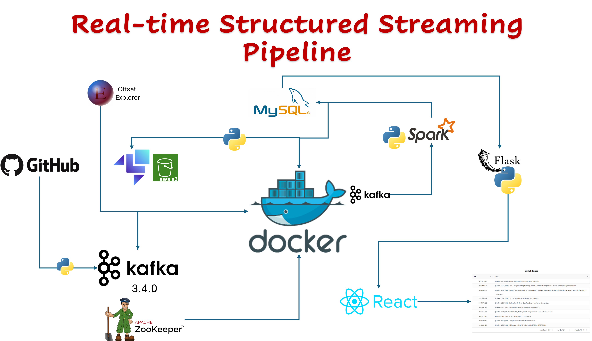

# 🚀 End-to-End GitHub Data Pipeline with Docker, Kafka, Spark, MySQL, React Dashboard

This project demonstrates a complete, containerized data pipeline for collecting GitHub data, processing it using Spark, storing it in MySQL, and visualizing it via a React dashboard. The infrastructure is simulated locally using Docker, LocalStack, and Terraform.

---

## 📦 **Tech Stack**

- **Docker & Docker Compose** — Containerization
- **LocalStack** — Local AWS Cloud Simulation (S3)
- **Terraform** — Infrastructure as Code
- **Kafka** — Real-time Streaming
- **PySpark** — Data Transformation
- **MySQL** — Relational Database
- **Flask** — REST API Backend
- **React** — Frontend Dashboard

---

## Pipeline Design




## 🛠️ **Setup Instructions**

### 1. **Docker & LocalStack**

- Install Docker:
  - [Windows Guide](https://docs.docker.com/desktop/setup/install/windows-install/)
  - [Mac Guide](https://docs.docker.com/desktop/setup/install/mac-install/)

- Pull and Run LocalStack:
  ```bash
  docker run -d --name localstack -p 4566:4566 -e SERVICES=s3,iam,lambda -e DEFAULT_REGION=us-east-1 -e HOSTNAME_EXTERNAL=localhost localstack/localstack
  ```
- Start Other Images:
    ```bash 
    cd docker-img
    docker compose up -d
    ```
- once you run the above command `docker compose`, it will create Kafka, Zookeeper and MySQL. The MySQL exposed port from `3306 -> 3307`. You need carefully, configure for back-edn API in Python to interact with MySQL 

### 2. Provision AWS Resources with Terraform

- Install Terraform: Terraform Installation as per your OS.
    - [Download Terraform](https://developer.hashicorp.com/terraform/install)
- From the terraforms directory:
    ```bash
    terraform init
    terraform plan
    terraform apply -auto-approve
    ```
- Test S3 Bucket:
    ```bash
    curl http://localhost:4566/github-pipeline-bucket   
    ```
### 3. Kafka Monitoring (Optional)

- Install Offset Explorer: https://www.kafkatool.com/

- Useful for inspecting Kafka topics and messages.

### 4. Python Environment & Dependencies

- Create and activate a virtual environment:
    ```bash
    python -m venv .myenv         # Windows
    python3 -m venv .myenv        # Mac/Linux
    .myenv\Scripts\activate       # Windows
    source .myenv/bin/activate    # Mac/Linux
    ```
- Install dependencies:
    ```bash
    pip install -r requirements.txt
    ```
    
### 📊 Pipeline Workflow

#### Step 1: GitHub Data Producer
    
    python github_producer.py

#### Step 2: Kafka to S3 Consumer

    python kafka_to_s3.py

#### Step 3: Spark Processing to MySQL
To run PySpark job, follow below step up.

- Download the [spark-hadoop](https://archive.apache.org/dist/spark/spark-3.5.5/spark-3.5.5-bin-hadoop3.tgz) and extract or unzip into `C:\` on windows or `/opt/` in Linux (change permissions ot read and write). Add the spark directory to your system `PATH` and `SPARK_HOME`. Once the `SPARK_HOME`, set completed, run the `spark-shell` in cmd/terminal.   

- You also need extra .jars to rea from S3A raw data from localstack to MySQL curated data. Download below `.jars ` and copy/move files to `<SPARK-HOME>/jars/`. 

- [MySQL Drivers](https://cdn.mysql.com/archives/mysql-connector-java-8.3/mysql-connector-j-8.3.0.zip)
- [Hadoop-AWS](https://repo1.maven.org/maven2/org/apache/hadoop/hadoop-aws/3.3.1/hadoop-aws-3.3.1.jar)
- [AWS-java-sdk-Bundle](https://repo1.maven.org/maven2/com/amazonaws/aws-java-sdk-bundle/1.11.1026/aws-java-sdk-bundle-1.11.1026.jar)

    ```
    python spark_s3_to_mysql.py
    ```

### 🌐 Backend API
- Run the Flask server:
    
    ``` 
    python flask_app.py
    ```
### 💻 Frontend Dashboard
- Navigate to `react-dashboard` directory:
    ```
    npm install
    npm start
    ```
- Access the dashboard at:
    ``` 
    http://localhost:3000
    ```
### 🐳 Docker Container Access
- To access a running container:
    ```
    docker exec -it <CONTAINER_ID> bash
    ```
### 📂 Directory Structure

    ├── docker-img/           # Docker Compose files
    ├── terraforms/           # Terraform scripts
    ├── react-dashboard/      # Frontend React app
    ├── github_producer.py    # GitHub Kafka producer
    ├── kafka_to_s3.py        # Kafka consumer to S3
    ├── spark_s3_to_mysql.py  # Spark transformation script
    ├── flask_app.py          # Backend API server
    ├── requirements.txt      # Python dependencies
    └── README.md              # Project documentation

### 📣 Notes
- Recommended to use .myenv for your virtual environments to easily ignore them via .gitignore.
- LocalStack provides a cost-effective testing environment without deploying to AWS.
- Offset Explorer is optional but helpful for inspecting Kafka messages.
